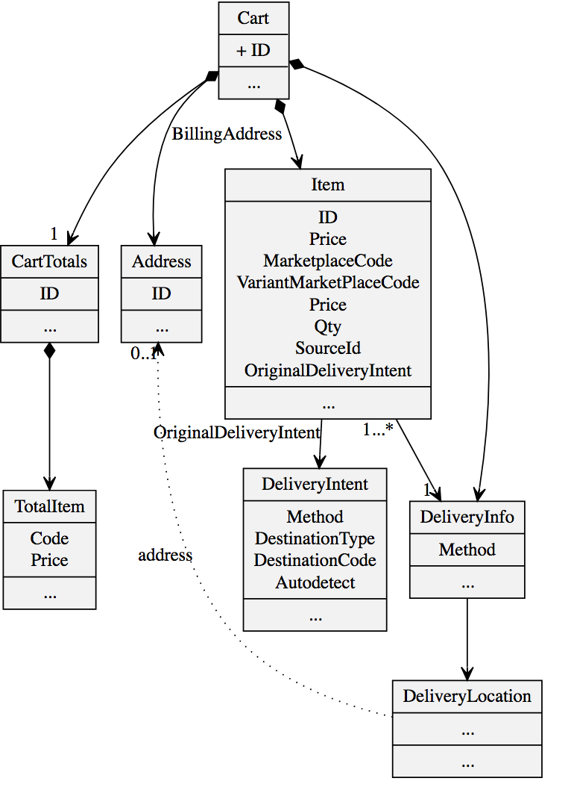
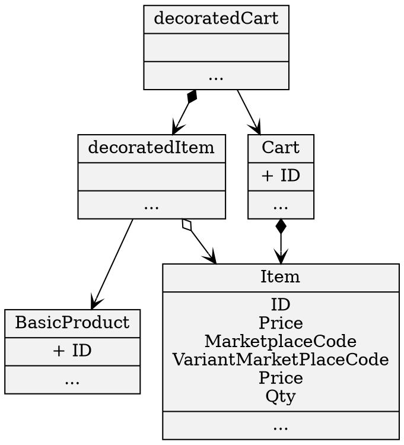
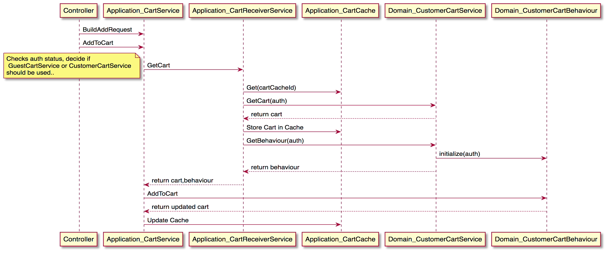

# Cart Module

The cart package offers a domain model for carts and its items - and the application services that should be used to get and modify cart(s).

It requires several ports to be implemented in order to have fully working cart functionality.
(for example the *flamingo-commerce-adapter-magento* package implements Adapters for the Ports)

The cart model supports multidelivery and multipayment.

Also the cart module and its services will be used by the checkout module.

## Principles / Summary

* The "Cart" aggregate in the Domain Model is a complex object that should be used as a pure **immutable Value object**:
    * Never change it directly!
    * Only read from it
* The Cart is only **modified by Commands** send to a CartBehaviour Object
* If you want to retrieve or change a  cart - **ONLY work with the application services**
    * This will ensure that the correct cache is used

## Usage

### Configurations

```yml
  cart:
    # To register the in memory cart service adapter (e.g. for development mode)
    useInMemoryCartServiceAdapters: true
    enableCartCache: true
    defaultDeliveryCode: "delivery"
    useEmailPlaceOrderAdapter: true
```

## Domain Model Details

### Cart Aggregate

Represents the Cart with PaymentInfos, DeliveryInfos and its Items:




### About Delivery

In order to support Multidelivery the cart cannot directly have Items attached, instead the Items belong to a Delivery.

That also means when adding Items to the cart you need to specify the delivery with a "code".

In cases where you only need one Delivery this can be configured as default and will be added on the fly for you.

#### DeliveryInfo

DeliveryInfo represents the information about which deliverymethod should be used and what deliverylocation should be used.
A deliverylocation can be a address, but also a location defined by a code (e.g. such as a collection point).

A DeliveryInfo has a "code" that should idendify a Delivery unique.

The DeliveryInfo object is normaly completed with all required infos during the checkout

##### Optional Port: DeliveryInfoBuilder
The DeliveryInfoBuilder interface defines an interface that builds DeliveryInfoUpdateCommand for a cart.

The "DefaultDeliveryInfoBuilder" that is part of the package should be ok for most cases, it simply takes the code and builds an initial DeliveryInfo object.
The code used by the "DefaultDeliveryInfoBuilder" should be speaking for that reason and is used to initialy create the DeliveryInfo:
The following String representations exists:

* pickup_store_LOCATIONCODE
    * DeliveryInfo to pickup the item in a (in)store pickup location
* pickup_collection_LOCATIONCODE
    * DeliveryInfo to pickup the item in a a special pickup location (central collectionpoint)
* pickup_autodetect
    * DeliveryInfo to pickup the items - but leave it to the solution to figure out the pickup point
* delivery (default)
    * DeliveryInfo to have the item (home) delivered

### CartItem details

There are special properties that require some explainations:

* SourceId: Optional represents a location that should be used to fillfill this Item. This can be the code of a certain warehouse or even the code of a retailstore (if item should be picked(sourced) from that location)
    * There is a SourcingService interface - that allows you to register the logic of how to decide on the sourceId

### Decorated Cart

If you need all the product informations at hand - use the Decorated Cart - its decorating the cart with references to the product (dependency product package)



## Details about Price fields

### Cartitems

| Key                                    | Desc                                                                                                                                                                                                                                                                      | Math Invariants                                                                                                             |
|----------------------------------------|---------------------------------------------------------------------------------------------------------------------------------------------------------------------------------------------------------------------------------------------------------------------------|-----------------------------------------------------------------------------------------------------------------------------|
| SinglePrice                            | Single price of product (brutto)                                                                                                                                                                                                                                          |                                                                                                                             |
| SinglePriceInclTax                     | (netto)                                                                                                                                                                                                                                                                   |                                                                                                                             |
| Qty                                    | Qty                                                                                                                                                                                                                                                                       |                                                                                                                             |
| RowTotal                               |                                                                                                                                                                                                                                                                           | RowTotal = SinglePrice * Qty                                                                                                |
| TaxAmount                              | Sum of all Taxes for this Row                                                                                                                                                                                                                                             | TaxAmount=Qty * (SinglePriceInclTax-SinglePrice)                                                                            |
| RowTotalInclTax                        |                                                                                                                                                                                                                                                                           | RowTotalInclTax = RowTotal + TaxAmount                                                                                      |
| AppliedDiscounts                       | List with the applied Discounts for this Item  (There are ItemRelated Discounts and Discounts that are not ItemRelated (Cart Related).  However it is important to know that at the end all DiscountAmounts are applied to an item (to make refunding logic easier later) |                                                                                                                             |
| TotalDiscountAmount                    | Complete Discount for the Row                                                                                                                                                                                                                                             | TotalDiscountAmount = Sum of AppliedDiscounts TotalDiscountAmount = ItemRelatedDiscountAmount +NonItemRelatedDiscountAmount |
| NonItemRelatedDiscountAmount           |                                                                                                                                                                                                                                                                           | NonItemRelatedDiscountAmount = Sum of AppliedDiscounts where IsItemRelated = false                                          |
| RowTotalWithItemRelatedDiscountInclTax |                                                                                                                                                                                                                                                                           | RowTotalWithItemRelatedDiscountInclTax=RowTotalInclTax-ItemRelatedDiscountAmount                                            |
| RowTotalWithDiscountInclTax            |                                                                                                                                                                                                                                                                           | RowTotalWithDiscountInclTax = RowTotalInclTax-TotalDiscountAmount                                                           |

### Carttotals:
| Key                          | Desc                                                                                              | Math Invariants                                                              |
|------------------------------|---------------------------------------------------------------------------------------------------|------------------------------------------------------------------------------|
| SubTotal                     | A Subtotal that you can use to show the total of items without any discounts and tax              | SubTotal = SUM of Item RowTotal                                              |
| SubTotalInclTax              | A Subtotal that you can use to show the total of items without any discounts and with tax         | SubTotalInclTax = SUM of Item RowTotalInclTax  / SubTotalInclTax = SubTotal + TaxAmount                                   |
| SubTotalWithDiscounts        | A Subtotal that you can use to show the total of items with discounts and without tax             | SubTotalWithDiscounts = SubTotal - Sum of Item ItemRelatedDiscountAmount     |
| SubTotalWithDiscountsAndTax  | A Subtotal that you can use to show the total of items with discounts and with tax                | SubTotalWithDiscountsAndTax= Sum of RowTotalWithItemRelatedDiscountInclTax   |
| TaxAmount                    | The total tax                                                                                     | TaxAmount = Sum of Item TaxAmount                                            |
| Totalitems                   | List of Totalitems. Each have a certain type - you may want to show some of them in the frontend. |                                                                              |
| TotalDiscountAmount          | The Total Discount.                                                                               | TotalDiscountAmount = SUM of Item TotalDiscountAmount                        |
| NonItemRelatedDiscountAmount | The Total of Discount that are not item related.                                                  | TotalDiscountAmount = SUM of Item NonItemRelatedDiscountAmount               |
| GrandTotal                   | The final amount that need to be payed by the customer                                            | GrandTotal = SubTotal + TaxAmount - DiscountAmount + SOME of Totalitems  / GrandTotal = (Sum of Items RowTotalWithDiscountInclTax) + SOME of Totalitems    |

## Domain - Secondary Ports

### Must Have Secondary Ports

**GuestCartService, CustomerCartService (and ModifyBehavior)**

GuestCartService and CustomerCartService are the two interfaces that act as secondary ports.
They need to be implemented and registered:

```
injector.Bind((*cart.GuestCartService)(nil)).To(infrastructure.YourAdapter{})
injector.Bind((*cart.CustomerCartService)(nil)).To(infrastructure.YourAdapter{})
```

Most of the cart modification methods are part of the `ModifyBehaviour` interface - if you look at the seconary ports you will see, that they need to return an (initialized) implementation of the
`ModifyBehaviour` interface - so in fact this interface need to be implemented when writing an adapter as well.

There is a "InMemoryAdapter" implementation as part of the package.

**PlaceOrderService**

There is also a `PlaceOrderService` interface as secondary port.
Implement an Adapter for it to define what should happen in case the cart is placed.

There is a `EmailAdapter` implementation as part of the package, that sends out the content of the cart as mail.

#### Optional Port: CartValidator

The CartValidator interface defines an interface to validate the cart.

If you want to register an implementation, it will be used to pass the validation results to the web view.
Also the cart validator will be used by the checkout - to make sure only valid carts can be placed as order.

#### Optional Port: ItemValidator

ItemValidator defines an interface to validate an item **BEFORE** it is added to the cart.

If an Item is not valid according to the result of the registered *ItemValidator* it will **not** be added to the cart.

### Store "any" data on the cart

This package offers a flexible way to store any additional objects on the cart:

See this example:

```go
type (
  // FlightData value object
  FlightData struct {
    Direction          string
    FlightNumber       string
  }
)

var (
  //need to implement the cart interface AdditionalDeliverInfo
  _ cart.AdditionalDeliverInfo = new(FlightData)
)

func (f *FlightData) Marshal() ([]byte, error) {
  return json.Marshal(f)
}

func (f *FlightData) Unmarshal(data []byte) error {
  return json.Unmarshal(data, f)
}


//Helper for storing additional data
func StoreFlightData(duc *cart.DeliveryInfoUpdateCommand, flight *FlightData) ( error) {
  if flight == nil {
    return nil
  }
  return duc.SetAdditional("flight",flight)
}

//Helper for getting stored data:
func GetStoredFlightData(d cart.DeliveryInfo) (*FlightData, error) {
  flight := new(FlightData)
  err := d.LoadAdditionalInfo("flight",flight)
  if err != nil {
    return nil,err
  }
  return flight, nil
}
```

## Application Layer

Offers the following services:

* CartReceiverService:
    * Responsible to get the current users cart. This is either a GuestCart or a CustomerCart
    * Interacts with the local CartCache (if enabled)
* CartService
    * All manipulation actions should go over this service (!)
    * Interacts with the local CartCache (if enabled)

Example Sequence for AddToCart Application Services to



## A typical Checkout "Flow"

A checkout package would use the cart package for adding informations to the cart, typically that would involve:

* Checkout might want to update Items:
    * Set sourceId (Sourcing logic) on an Item and then call CartBehaviour->UpdateItem(item,itemId)

* Updating DeliveryInformations by Calling CartBehaviour->UpdateDeliveryInfo())
    * (for updating ShippingAddress, WhishDate, ...)

* Optional Updating Purchaser Infos  by Calling CartBehaviour->UpdatePurchaser()

* Finish by calling CartService->PlaceOrder(CartPayment)
    * CartPayment is an object, which holds the informations which Payment is used for which item

## Interface Layer

### Cart Controller

The main Cart Controller expects the following templates by default:

* checkout/cart
* checkout/carterror

The templates get the following variables passed:

* DecoratedCart
* CartValidationResult

### Cart Ajax API

There are also of course ajax endpoints, that can be used to interact with the cart directly from your browser and the javascript functionality of your template.

#### Get Cart Content:

* http://localhost:3210/en/api/cart

#### Adding products

* Simple product: http://localhost:3210/en/api/cart/add/fake_simple
* With qty: http://localhost:3210/en/api/cart/add/fake_simple?qty=10
* Adding configurables: http://localhost:3210/en/api/cart/add/fake_configurable?variantMarketplaceCode=shirt-white-s
* Adding configurables with a given intent: http://localhost:3210/en/api/cart/add/fake_configurable?variantMarketplaceCode=shirt-white-s&deliveryIntent=pickup_collection_arrivals
