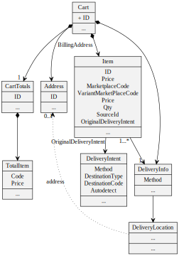
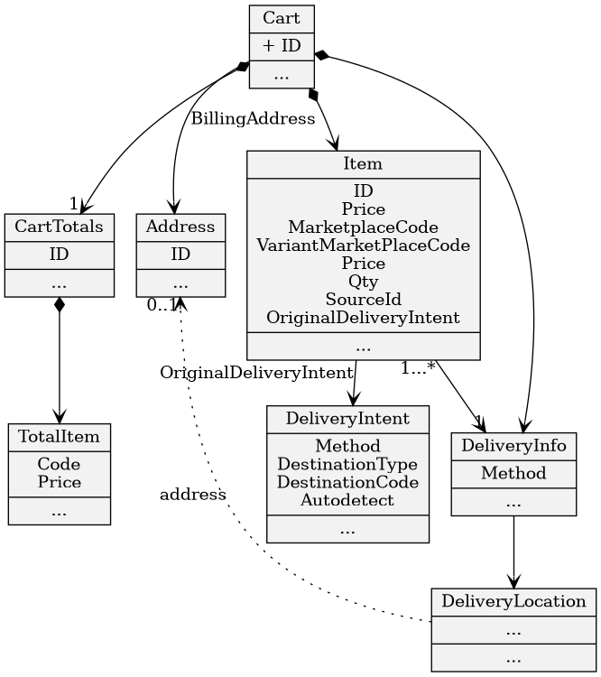
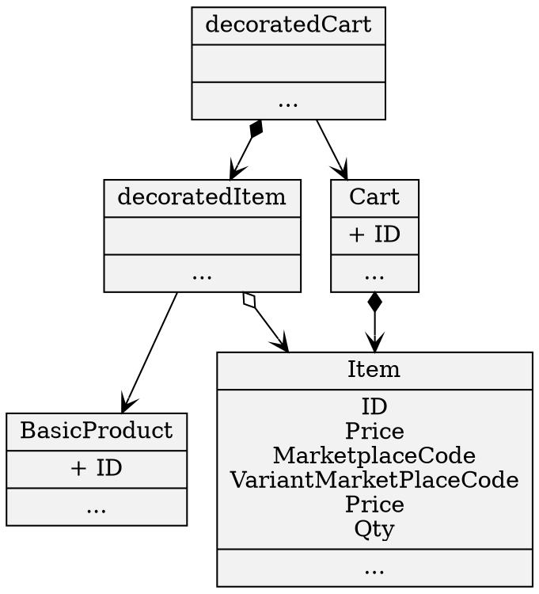

# Cart Module

The cart package offers a domain model for carts and its items - and the application services that should be used to get and modify cart(s).

It requires several ports to be implemented in order to have fully working cart functionality. (for example the *magento* package implements Adapters for the Ports)


## Principles / Summary
* The "Cart" aggregate in the Domain Model is a complex object that should be used as a pure **immutable Value object**:
    * Never change it directly!
    * Only read from it
* The Cart is only **modified by Commands** send to a CartBehaviour Object
* If you want to retrieve or change a  cart - **ONLY work with the application services**
    * This will ensure that the correct cache is used

## Usage

### Configurations

```
  
  cart:
    # To register the in memory cart service adapter (e.g. for development mode)
    useInMemoryCartServiceAdapters: true
    defaultDeliveryIntent: "pickup_autodetect"
    enableCartCache: true
    
```

# Model Details:

## Domain Layer

### Cart Aggregate
Represents the Cart with PaymentInfos, DeliveryInfos and its Items:





### CartItem details

There are special properties that require some explainations:
* OriginalDeliveryIntent: points to a description of what the user intent was when adding the item to the cart (see below)
* DeliveryInfoReference: References the DeliveryInfo that is assigned to this item. (This allows a cart with multishippment) (Is only set if a DeliveryInfoUpdateCommand was send to the cartBehaviour)
* SourceId: Optional represents a location that should be used to fillfill this Item. This can be the code of a certain warehouse or even the code of a retailstore (if item should be picked(sourced) from that location)
    * There is a SourcingService interface - that allows you to register the logic of how to decide on the sourceId

### Decorated Cart

If you need all the product informations at hand - use the Decorated Cart - its decorating the cart with references to the product (dependency product package)




### Must Have Secondary Ports: GuestCartService, CustomerCartService and CartBehavior

GuestCartService, CustomerCartService and CartBehaviour are defined as Interfaces.

They need to be implemented and registered.

There is a example implementation against the Magento Cart API.


### About DeliveryInfo and DeliveryIntent

Short:
The DeliveryIntent represents the Intent the user has when adding an item to the cart. 
The DeliveryInfo represents the real Delivery used for the item. 
The DeliveryIntent given during adding to cart will define the initial DeliveryInfo.

#### DeliveryIntent
* DeliveryIntent: Represents the Intent that a user has when adding the item into the cart.  This can be for example:
    * User wants to pick up the item on a certain instore pickup point, or a collectionpoint
    * User wants the item to be home delivered
    * ...
* The DeliveryIntent can be passed during adding an item to the cart (with the parameter "deliveryIntent") - here the STRING representation of the deliveryIntent is given
* DeliveryIntent (Object) <---> DeliveryIntent (String Representation)
    * The Object is used to better deal with the infos
    * The string is used to pass in url parameters (and can also be used for persitence)
    * There is a Converter for transforming one into the other
    * The following String representations exists:
        * pickup_store_LOCATIONCODE
            * Intent to pickup the item in a (in)store pickup location
        * pickup_collection_LOCATIONCODE
            * Intent to pickup the item in a a special pickup location (central collectionpoint)
        * pickup_autodetect
            * Intent to pickup the items - but leave it to the solution to figure out the pickup point
        * delivery (default)
            * Intent to have the item (home) delivered
#### DeliveryInfo
* DeliveryInfo= The real representation of the Delivery used
    * Is normaly completed with all required infos during the checkout
* The DeliveryIntent given during adding to cart will define the initial DeliveryInfo.
    * If its the same intent that was used before an existing DeliverInfo will be used - if its the first time, the the DeliveryInfo will be added.
        * This logic belongs to the CartBehaviour and is therefore up to the concrete Implementation

#### Optional Port: DeliveryInfoBuilder
The DeliveryInfoBuilder interface defines an interface that builds DeliveryInfoUpdateCommand for a cart.

The "DefaultDeliveryInfoBuilder" that is part of the package should be ok for most cases, it simply takes the infos in the DeliveryIntent of the Items and returns the DefaultDeliveryInfoBuilder accordingly.

The DeliveryInfoBuilder interface can be used in checkout to prepare the DeliveryInfos on the cart.


#### Optional Port: CartValidator
The CartValidator interface defines an interface the validate the cart.

If you want to register an implementation, it will be used to pass the validation results to the web view.


#### Optional Port: ItemValidator
ItemValidator defines an interface to validate an item BEFORE it is added to the cart.

If an Item is not Valid according to the result of the registered ItemValidator it will not be added to the cart.


#### I just have homedelivery - do I need this?
Not really:
A standard online shop won't need the flexibility provided by this objects.
However the underlying logic is the same. 
But the user of the shop cannot distinguish between different deliveries - and therefore a configured default will be used

Most likely you will only need to set:
```
cart.defaultDeliveryIntent=delivery
``` 
To indicate that always the intent is to have the item delivered (to home or any address)


## Application Layer

Offers the following services:
* CartReceiverService:
    * Responsible to get the current users cart. This is either a GuestCart or a CustomerCart
    * Interacts with the local CartCache (if enabled)
* CartService
    * All manipulation actions should go over this service (!)
    * Interacts with the local CartCache (if enabled)

Example Sequence for AddToCart Application Services to 

```sequence
Controller->Application/CartService:BuildAddRequest(marketplaceCode,\nvariantCode,deliveryIntent)
Controller->Application/CartService:AddToCart

Application/CartService->Application/CartReceiverService:GetCart
note over Application/CartReceiverService:Checks Login status and decide if \n GuestCartService or CustomerCartService \nshould be used
note over Application/CartReceiverService:Also checks if Cache exists
Application/CartReceiverService->Application/CartCache:Get(cartCacheId)
Application/CartReceiverService->Domain/CustomerCartService:GetCart(auth)
Domain/CustomerCartService-->Application/CartReceiverService:return cart


Application/CartReceiverService->Application/CartCache:Store Cart in Cache

Application/CartReceiverService->Domain/CustomerCartService:GetBehaviour(auth)
Domain/CustomerCartService->Domain/CustomerCartBehaviour:initialize(auth)

Domain/CustomerCartService-->Application/CartReceiverService:return behaviour
Application/CartReceiverService-->Application/CartService:return cart,behaviour

Application/CartService->Domain/CustomerCartBehaviour:AddToCart(cart,addRequest)
Domain/CustomerCartBehaviour-->Application/CartService:return updated cart

Application/CartService->Application/CartCache:Update Cache

```


### Secondary Port: PickUpDetectionService

* PickUpDetectionService - Interface that can be used to auto-detect correct pickupLocation - Only called if an item with the DeliveryIntent "pickup-autodetect" is added


### A typical Checkout "Flow"

A checkout package would use the cart package for adding informations to the cart, typically that would involve:

* Checkout might want to update Items:
    * Set sourceId (Sourcing logic) on an Item and then call CartService->UpdateItem(item,itemId)

* Updating DeliveryInformations by Calling CartService->UpdateDeliveryInfosAndBilling())
    * (for updating ShippingAddress, WhishDate, ...)
    * Here it makes sense to use the "DeliveryInfoBuilder" to get the Update Commands
* Optional Updating Purchaser Infos  by Calling CartService->UpdatePurchaser()
* Finish by calling CartService->PlaceOrder(CartPayment)
    * CartPayment: holds the informations which Payment is used for which item

## Interface Layer

### Cart Controller ###
Controller that expects the following templates:
* checkout/cart
* checkout/carterror

The templates get the following variables passed:
* DecoratedCart
* CartValidationResult

### Cart Ajax API ###

#### Get Cart Content:
* http://localhost:3210/en/api/cart

#### Adding products:

* Simple product: http://localhost:3210/en/api/cart/add/fake_simple
* With qty: http://localhost:3210/en/api/cart/add/fake_simple?qty=10
* Adding configurables: http://localhost:3210/en/api/cart/add/fake_configurable?variantMarketplaceCode=shirt-white-s
* Adding configurables with a given intent: http://localhost:3210/en/api/cart/add/fake_configurable?variantMarketplaceCode=shirt-white-s&deliveryIntent=pickup_collection_arrivals


