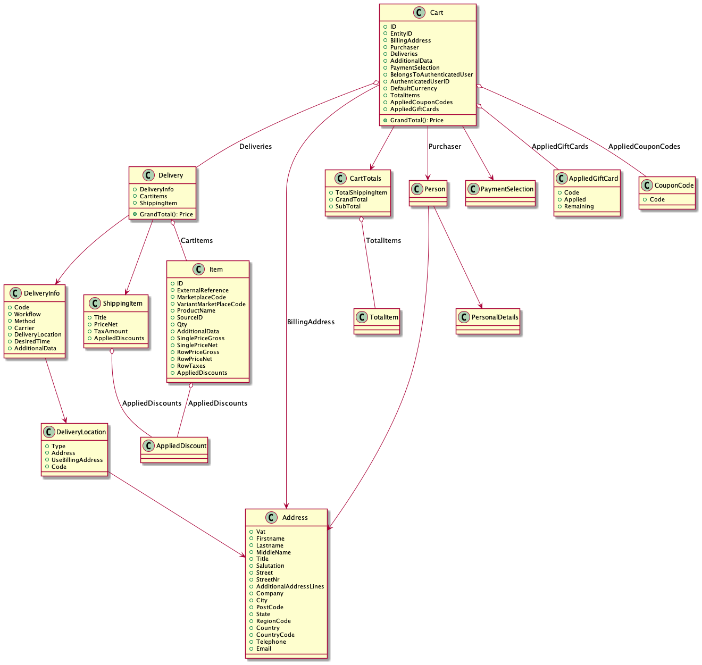

# Cart Module

The cart module is one of the main modules in Flamingo Commerce. It offers:

* *domain layer*: 
    * domain models for carts, deliveries and their items. 
    * cartservices: the secondary ports required for modifying the cart.
    * orderservice: the secondary port called when placing the cart as order
    * support for multiple deliveries
    * support for multipayment
* *application layer* useful application services, that should be used to get and modify the carts. That also includes a transparent session based cart cache to cache carts in cases where updating and reading the cart (e.g. against an external API) is too slow.
* *interface layer* Controllers and Actions to render the carrt pages. Also a flexible to use Ajax API that can be used to modify the cart.
* *infrastructure layer* 
    * Sample adapter for the secondary ports that maneges the cart in memory.
    * Sample adapter that will log a json file with every for placing an order

There will be additional Flamingo modules that provide adapters for the secondary ports against common e-commerce APIs like Magento 2.
The cart module and its services are used by the checkout module.

## Usage

### Configurations

For all possible configurations you can check the `module.go` (CueConfig function)
As always you can also dump the current configuration with the "config" Flamingo command.

Here is a typical configuration
```yaml
  commerce.cart:
    # enable the secondary adapters for the cart services.  (e.g. for testing or development mode)
    useInMemoryCartServiceAdapters: true
    # enable the cache
    enableCartCache: true
    # set the default delivery code that is used if no other is given
    defaultDeliveryCode: "delivery"
```

## Domain Model Details

### Cart Aggregate

Represents the Cart with PaymentInfos, DeliveryInfos and its Items:



### Immutable cart / Updating the cart
* The "Cart" aggregate in the Domain Model is a complex object that should be used as a pure **immutable value object**:
    * Never change it directly!
    * Only read from it
* The Cart is only **modified by Commands** send to a CartBehaviour Object
* If you want to retrieve or change a  cart - **ONLY work with the application services**. This will ensure that the correct cache is used


### About Delivery

In order to support Multidelivery the cart cannot directly have Items attached, instead the Items belong to a Delivery.

That also means when adding Items to the cart you need to specify the delivery with a "code".

In cases where you only need one Delivery this can be configured as default and will be added on the fly for you.

#### DeliveryInfo

DeliveryInfo represents the information about which delivery method should be used and what delivery location should be used.

A DeliveryInfo has:
* a `code` that should identify a Delivery unique under the cart. It's up to you what code you want. You may want to follow the conventions used by the Default `DeliveryInfoBuilder`
* a `workflow` - that is used to be able to differentiate between different fulfillment workflows (e.g. pickup or delivery)
* a `method` - used to specify details for the delivery. It's up for the project what you want to use. E.g. use it to differentiate between `standard` and `express`
* a `deliverylocation` - A deliverylocation can be an address, but also a location defined by a code (e.g. such as a collection point).

The DeliveryInfo object is normally completed with all required infos during the checkout using the DeliveryInfoUpdateCommand

##### Optional Port: DeliveryInfoBuilder

The DeliveryInfoBuilder interface defines an interface that builds initial `DeliveryInfo` for a cart.

The `DefaultDeliveryInfoBuilder` that is part of the package should be ok for most cases, it simply takes the passed `deliverycode` and builds an initial `DeliveryInfo` object.
The code used by the `DefaultDeliveryInfoBuilder` should be speaking for that reason and is used to initially create the `DeliveryInfo`:

The convention used by this default builder is as follow: `WORKFLOW_LOCATIONTYPE_LOCATIONCODE_METHOD_anythingelse`

Valid codes are:
* `delivery` (default)
    * DeliveryInfo to have the item (home) delivered
* `pickup_store_LOCATIONCODE`
    * DeliveryInfo to pickup the item in a (in)store pickup location
* `pickup_collection_LOCATIONCODE`
    * DeliveryInfo to pickup the item in a special pickup location (central collection point)


### CartItem details

There are special properties that require some explanations:

* `SourceId`: Optional represents a location that should be used to fulfill this item. 
This can be the code of a certain warehouse or even the code of a retail store (if the item should be picked(sourced) from that location)
    * There is a SourcingService interface - that allows you to register the logic of how to decide on the `SourceId`

### Decorated Cart

If you need all the product information at hand - use the Decorated Cart - its decorating the cart with references to the product (dependency product package)


## Details about Price fields

Make sure you read the product package details about prices.

The cart needs to show prices with their taxes and additional cart discounts and all different subtotals etc.
What you want to show depends on the project, the type of shop (B2B or B2C), the discount logic and the implemented calculation details of the underlying cartservice implementation.

Some of the prices you may want to show are "calculable" on the fly (in this cases they are offered as methods) - but some highly depend on the tax and discount logic and they need to have the correct values set by the underlying cartservice implementation.

### Cart invariants

* While the Flamingo price model (which is used) can calculate exact prices internal, we need "payable prices" to be set in the cart. This is to allow consistent adding and subtracting of prices and still always get a price that is payable.

* All sums - also the cart grand total is calculated and can be "tracked" back to the item row prices.

In order to get consistent sub totals in the cart, the cart model needs certain invariants to be matched:
* Item level: RowPriceNet + TotalTaxAmount = RowPriceGross
* Item level: TotalDiscount <= RowPriceGross
* All main prices need to have same currency (that may be extended later but currently it is a constraint)

### About Tax calculation in general

It makes sense to understand the details of tax calculations - so please take the following example of a cart with 2 items:
* item1 net price 14,71
* item2 net price 10,18
* and a 19% VAT (G.S.T)

There are two principal ways of tax calculations (called vertical and horizontal)
* vertical: the final tax is calculated from the sum of all rounded item taxes: 
    * item1 +19% gross price rounded: 17,50 (tax 2,79)
    * item2 +19% gross price rounded: 12,11 (tax 1,93)
    * = GrandTotal = 29,61 / = totalTax: 4,72
    * => SubTotalNet = 24,89
    * Often preferred for B2C, when the item prices are shown as gross prices first.
    * Pro: Easier to calculate 
    * Con: rounding errors may sum up in big orders
    
* horizontal: The final tax is calculated from the sum of all net prices of the item and then rounded
    * => SubTotalNet: 24,89  => +19% rounded GrandTotal: 29,62 / included Tax: 4,73
    * Often preferred for B2B or when the prices shown to the customer are as net prices at first.

* In both cases the tax might be calculated from a given net price or a given gross price (see product package config `commerce.product.priceIsGross`).

* discounts are normally subtracted before tax calculation

* At least in germany the law doesn't force one algorithm over the other. In this cart module it is up to the CartService implementation what algorithm it uses to fill the tax.

* Flamingo cart model calculates sums of prices and taxes using the "vertical" way - its doing this by basically adding the prices in the items up on delivery and cart levels. So if you want to use "horizontal" tax calculations the cartservice implementation need to make sure that the item prices are set correct (split correct with cent corrections - outgoing from the horizontal sums).


### Cartitems - price fields and method 

The Key with "()" in the list are methods and it is assumed as an invariant, that all prices in an item have the same currency.

| Key                                    | Desc                                                                                                                                                                                                                                                                      | Math Invariants                                                                                                             |
|----------------------------------------|---------------------------------------------------------------------------------------------------------------------------------------------------------------------------------------------------------------------------------------------------------------------------|-----------------------------------------------------------------------------------------------------------------------------|
| SinglePriceGross                       | Single price of product (gross) (was SinglePrice)                                                                                                                                                                                                                         |                                                                                                                             |
| SinglePriceNet                         | (net)                                                                                                                                                                                                                                                                     |                                                                                                                             |
| Qty                                    | Qty                                                                                                                                                                                                                                                                       |                                                                                                                             |
| RowPriceGross                          | (was RowTotal )                                                                                                                                                                                                                                                           | RowPriceGross ~ SinglePriceGross * Qty                                                                                      |
| RowPriceNet                            |                                                                                                                                                                                                                                                                           | RowPriceNet ~ SinglePriceNet * Qty                                                                                          |
| RowTaxes                               | Collection of (summed up) Taxes for that item row.                                                                                                                                                                                                                        |                                                                                                                             |
| TotalTaxAmount()                       | Sum of all Taxes for this Row                                                                                                                                                                                                                                             | = RowPriceGross-RowPriceNet                                                                                                 |
| AppliedDiscounts                       | List with the applied Discounts for this Item  (There are ItemRelated Discounts and Discounts that are not ItemRelated (CartRelated). However it is important to know that at the end all DiscountAmounts are applied to an item (to make refunding logic easier later)   |                                                                                                                             |
| TotalDiscountAmount()                  | Complete Discount for the Row. If the Discounts have no tax/duty (they can be considered as Gross). If they are applied from RowPriceGross or RowPriceNet depends on the calculations done in the cartservice implementation.                                             | TotalDiscountAmount = Sum of AppliedDiscounts TotalDiscountAmount = ItemRelatedDiscountAmount +NonItemRelatedDiscountAmount |
| NonItemRelatedDiscountAmount()         |                                                                                                                                                                                                                                                                           | NonItemRelatedDiscountAmount = Sum of AppliedDiscounts where IsItemRelated = false                                          |
| ItemRelatedDiscountAmount()            |                                                                                                                                                                                                                                                                           | ItemRelatedDiscountAmount = Sum of AppliedDiscounts where IsItemRelated = false                                             |
| RowPriceGrossWithDiscount()            |                                                                                                                                                                                                                                                                           | RowPriceGross-TotalDiscountAmount()                                                                                         |
| RowPriceNetWithDiscount()              |                                                                                                                                                                                                                                                                           |                                                                                                                             |
| RowPriceGrossWithItemRelatedDiscount() |                                                                                                                                                                                                                                                                           | RowPriceGross-ItemRelatedDiscountAmount()                                                                                   |
| RowPriceNetWithItemRelatedDiscount()   |                                                                                                                                                                                                                                                                           |                                                                                                                             |
|                                        |                                                                                                                                                                                                                                                                           |                                                                                                                             |

[comment]: <> (use https://www.tablesgenerator.com/markdown_tables to update the table)

### Delivery - price fields and method 
| Key                               | Desc | Math                                       |
|-----------------------------------|------|--------------------------------------------|
| SubTotalGross()                   |      | Sum of items RowPriceGross                 |
| SumRowTaxes()                     |      | List of the sum of the different RowFees   |
| SumTotalTaxAmount()               |      | List of the sum of the TotalTaxAmount      |
| SubTotalNet()                     |      | Sum of items RowPriceNet                   |
| SubTotalGrossWithDiscounts()      |      | SubTotalGross() - SumTotalDiscountAmount() |
| SubTotalNetWithDiscounts          |      | SubTotalNet() - SumTotalDiscountAmount()   |
| SumTotalDiscountAmount()          |      | Sum of items TotalDiscountAmount           |
| SumNonItemRelatedDiscountAmount() |      | Sum of items NonItemRelatedDiscountAmount  |
| SumItemRelatedDiscountAmount()    |      | Sum of items ItemRelatedDiscountAmount     |


### Cart - price fields and method 

| Key                               | Desc                                                                                                                                                | Math                                                                                                                                                     |
|-----------------------------------|-----------------------------------------------------------------------------------------------------------------------------------------------------|----------------------------------------------------------------------------------------------------------------------------------------------------------|
| GrandTotal()                      | The final amount that need to be paid by the customer (Gross)                                                                                      | = SubTotalGross()  - SumTotalDiscountAmount() + Totalitems                                                                                               |
| Totalitems                        | List of (additional) Totalitems. Each have a certain type - you may want to show some of them in the frontend.                                      |                                                                                                                                                          |
| SumShippingNet()                  | Sum of all shipping costs as Price                                                                                                               | The sum of the deliveries shipping                                                                                                                       |
| SubTotalGross()                   |                                                                                                                                                     | Sum of deliveries SubTotalGross()                                                                                                                        |
| SumTaxes()                        | The total taxes of the cart - as list of Tax                                                                                                        |                                                                                                                                                          |
| SumTotalTaxAmount()               | The overall Tax of cart as Price                                                                                                                    |                                                                                                                                                          |
| SubTotalNet()                     |                                                                                                                                                     | Sum of deliveries SubTotalNet()                                                                                                                          |
| SubTotalGrossWithDiscounts()      |                                                                                                                                                     | SubTotalGross() - SumTotalDiscountAmount()                                                                                                               |
| SubTotalNetWithDiscounts()        |                                                                                                                                                     | SubTotalNet() - SumTotalDiscountAmount()                                                                                                                 |
| SumTotalDiscountAmount()          | The overall applied discount                                                                                                                        | Sum of deliveries TotalDiscountAmount                                                                                                                    |
| SumNonItemRelatedDiscountAmount() |                                                                                                                                                     | Sum of deliveries NonItemRelatedDiscountAmount                                                                                                           |
| SumItemRelatedDiscountAmount()    |                                                                                                                                                     | Sum of deliveries ItemRelatedDiscountAmount                                                                                                              |
| GetVoucherSavings()               | Returns the sum of Totals from type voucher                                                                                                         |                                                                                                                                                          |
| HasShippingCosts()                | True if cart has in sum any shipping costs                                                                                                          |                                                                                                                                                          |
| SumAppliedGiftCards()             |                                                                                                                                                     | Sum of all Applied GiftCard amounts                                                                                                                      |
| SumGrandTotalWithGiftCards()      | The final amount with the applied gift cards subtracted. If there are no gift cards, equal to GrandTotal()                                    | GrandTotal() - SumAppliedGiftCards()                                                                                                                     |

### Typical B2C vs B2B usecases

B2C use cases:
* The item price is with all fees (gross). The discount will be reduced from the price and all the fees, duty and net price will be calculated from this.
* Typically you want to show per row:
    * SinglePriceGross
    * Qty
    * RowPriceGross
    * RowPriceGrossWithDiscount

* The cart normally shows:
   * SubTotalGross
   * Carttotals (non taxable extra lines on cart level)
   * Shipping
   * The included Total Tax in Cart (SumTaxes) 
   * GrandTotal (is what the customer needs to pay at the end including all fees)

B2B use cases:
* The item price is without fees (net). The discount will be reduced and then the fees will be added to get the gross price. You probably do want to show per row:
    *  SinglePriceNet
    *  RowPriceNet
    *  RowPriceNetWithDiscount
    
* The cart then normally shows:
   * SubTotalNet
   * Carttotals (non taxable extra lines on cart level)
   * Shipping
   * The included Total Tax in Cart (SumTaxes) 
   * GrandTotal (is what the customer need to pay at the end inkl all fees)
 
### Building a Cart with its deliveries and items

The domain concept is that the cart is returned and updated by the "Cartservice" - which is the main secondary port of the package that needs to be implemented (see below).
The implementations should use the provided "Builder" objects to build up Items, Deliveries and Carts. The Builder items ensure that the invariants are met and help with calculations of missing values.

e.g. to build an item:
```go
builder := t.itemBuilderProvider()
item, err := builder.SetSinglePriceNet(priceDomain.NewFromInt(100, 100, "EUR")).SetQty(10).SetID("22").SetUniqueID("kkk").CalculatePricesAndTaxAmountsFromSinglePriceNet().Build()

``` 
 
### About charges
If you have read the sections above you know about the different prices that are available at item, delivery and cart level and how they are calculated.

There is something else that this cart model supports - we call it "charges". All the price amounts mentioned in the previous chapters represents the value of the items in the carts default currency.

However this value need to be paid - when paying the value it can be that:
- customer wants to pay with different payment methods (e.g. 50% of the value with PayPal and the rest with credit card)
- also the value can be paid in a different currency


The desired split of charges is saved on the cart with the "UpdatePaymentSelection" command.
If you dont need the full flexibility of the charges, than you will simply always pay one charge that matches the grand total of your cart.
Use the factory `NewDefaultPaymentSelection` for this, which also supports gift cards out of the box.

The PaymentSelection supports the [Idempotency Key pattern](https://stripe.com/blog/idempotency), the `DefaultPaymentSelection` will generate a new random UUID v4 during creation.
In cases of a payment error (e.g. aborted by customer / general error) the Idempotency Key needs to be regenerated to avoid a loop and enable the customer to retry the payment.
The PaymentSelection therefore offers a `GenerateNewIdempotencyKey()` function, which should also called during generation of the PaymentSelection.

If you want to use the feature it is important to know how the cart charge split should be generated:

1. the product that is in the cart might require that his price is paid in certain charges. An example for this is products that need to be paid in miles.
2. the customer might want to select a split by himself

You can use the factory on the decorated cart to get a valid PaymentSelection based on the two facts

It is also important to note that changes to the shopping cart may affect an existing PaymentSelection. We therefore recommend that you validate PaymentSelection after each shopping cart transaction.

## Domain - Secondary Ports

### Must Have Secondary Ports

**GuestCartService, CustomerCartService (and ModifyBehavior)**

`GuestCartService` and `CustomerCartService` are the two interfaces that act as secondary ports.
They need to be implemented and registered:

```go
injector.Bind((*cart.GuestCartService)(nil)).To(infrastructure.YourAdapter{})
injector.Bind((*cart.CustomerCartService)(nil)).To(infrastructure.YourAdapter{})
```

Most of the cart modification methods are part of the `ModifyBehaviour` interface - if you look at the secondary ports you will see, that they need to return an (initialized) implementation of the
`ModifyBehaviour` interface - so in fact this interface needs to be implemented when writing an adapter as well.

**in-memory cart adapter**
There is a "InMemoryAdapter" implementation as part of the package. It allows basic cart operations with a cart that is stored in memory.
Since the cart storage is not persisted in any way we currently recommend the usage only for demo / testing.

The in memory adapter supports custom gift card / voucher logic by implementing the `GiftCardHandler` and `VoucherHandler` interfaces.

**PlaceOrderService**

There is also a `PlaceOrderService` interface as secondary port.
Implement an adapter for it to define what should happen in case the cart is placed.

There is a `EmailAdapter` implementation as part of the package, that sends out the content of the cart as mail.

#### Optional Port: CartValidator

The CartValidator interface defines an interface to validate the cart.

If you want to register an implementation, it will be used to pass the validation results to the web view.
Also the cart validator will be used by the checkout - to make sure only valid carts can be placed as order.

#### Optional Port: ItemValidator

ItemValidator defines an interface to validate an item **BEFORE** it is added to the cart.

If an Item is not valid according to the result of the registered *ItemValidator* it will **not** be added to the cart.

### Store "any" data on the cart

This package offers also a flexible way to store any additional objects on the cart:

See this example:

```go
type (
  // FlightData value object
  FlightData struct {
    Direction          string
    FlightNumber       string
  }
)

var (
  // need to implement the cart interface AdditionalDeliverInfo
  _ cart.AdditionalDeliverInfo = new(FlightData)
)

func (f *FlightData) Marshal() ([]byte, error) {
  return json.Marshal(f)
}

func (f *FlightData) Unmarshal(data []byte) error {
  return json.Unmarshal(data, f)
}


// Helper for storing additional data
func StoreFlightData(duc *cart.DeliveryInfoUpdateCommand, flight *FlightData) ( error) {
  if flight == nil {
    return nil
  }
  return duc.SetAdditional("flight",flight)
}

// Helper for getting stored data:
func GetStoredFlightData(d cart.DeliveryInfo) (*FlightData, error) {
  flight := new(FlightData)
  err := d.LoadAdditionalInfo("flight",flight)
  if err != nil {
    return nil,err
  }
  return flight, nil
}
```

## Application Layer

Offers the following services:

* CartReceiverService:
    * Responsible to get the current users cart. This is either a GuestCart or a CustomerCart
    * Interacts with the local CartCache (if enabled)
* CartService
    * All manipulation actions should go over this service (!)
    * Interacts with the local CartCache (if enabled)

Example Sequence for AddToCart Application Services to


### RestrictionService

The Restriction Service provides a port for implementing product restrictions. By using Dingo multibinding to `cart.MaxQuantityRestrictor`,
you can add your own restriction to the service. The Restriction Service is called during cart add / update item.

The `Restrict` function returns a `RestrictionResult` containing information about the restriction. This `RestrictionResult` specifies whether a restriction applies,
the maximum allowed quantity and the remaining difference in relation to the current cart.

The Service itself consolidates the results of all bound restrictors and returns the most restricting result.

## A typical Checkout "Flow"

A checkout package would use the cart package for adding information to the cart, typically that would involve:

* Checkout might want to update Items:
    * Set sourceId (Sourcing logic) on an item and then call `CartBehaviour.UpdateItem(item,itemId)`

* Updating DeliveryInformation by calling `CartBehaviour.UpdateDeliveryInfo()`
    * (for updating ShippingAddress, WishDate, ...)

* Optional updating Purchaser Infos by calling `CartBehaviour.UpdatePurchaser()`

* Finish by calling `CartService.PlaceOrder(CartPayment)`
    * CartPayment is an object, which holds the information which Payment is used for which item

## Interface Layer

### Cart Controller

The main Cart Controller expects the following templates by default:

* checkout/cart
* checkout/carterror

The templates get the following variables passed:

* DecoratedCart
* CartValidationResult

### Cart template function

Use the `getCart` template function to get the cart.
Use the `getDecoratedCart` template function to get the decorated cart.

```pug
-
  var cart = getCart()
  var decoratedCart = getDecoratedCart()
  var currentCount = decoratedCart.cart.getCartTeaser.itemCount
```

### Cart Ajax API

There are also of course ajax endpoints, that can be used to interact with the cart directly from your browser and the javascript functionality of your template.
To get an idea of all endpoints, have a look at the module.go, especially the apiRoutes method where endpoints are handled.


### GraphQL

The module exposes most of its functionality also via GraphQL, have a look at the [schema](interfaces/graphql/schema.graphql) to see all available querys / mutations.
