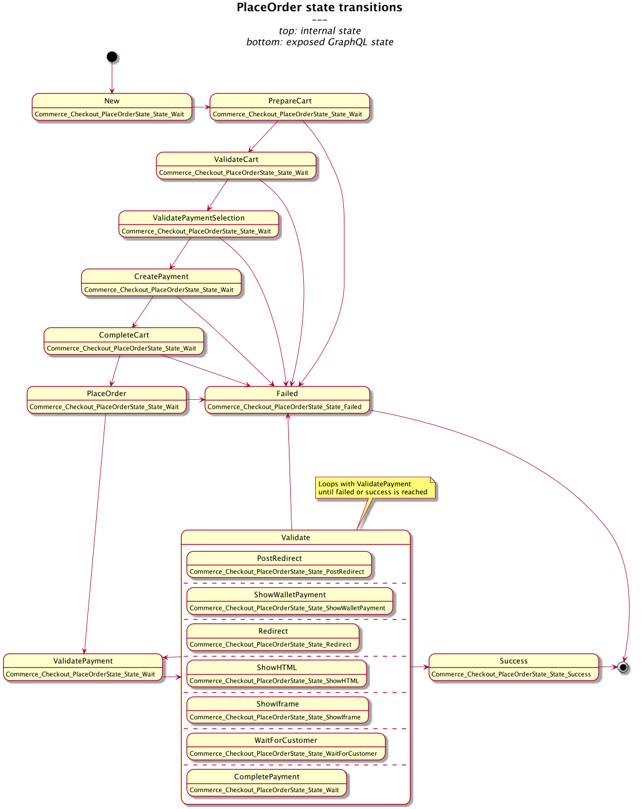

# Checkout Package

This package provides a one page standard checkout with the following features:

* Concept for PaymentProviders, that can be used to implement specific Payments
* An "offline payment" provider is part of the module

**Table of content**

* [Configurations](#configurations)
* [Checkout Controller](#checkout-controller)
* [GraphQL Place Order Process](#graphql-place-order-process)
  + [Queries / Mutations](#queries---mutations)
  + [Place Order States](#place-order-states)
  + [Context store](#context-store)
    - [Ports / Implementation](#ports---implementation)
  + [Locking](#locking)
    - [Ports / Implementation](#ports---implementation-1)
* [Provided Ports](#provided-ports)
  + [Sourcing Service Secondary Ports](#sourcing-service-secondary-ports)
  + [Process Context Store](#process-context-store)
  + [Process Lock](#process-lock)

## Configurations

If your template does not want to ask for all the information required you can also set default values for the checkoutform (strings)

```yaml
commerce:
  checkout:
    # use a faked sourcing service
    useFakeSourcingService: false
    # to enable the offline payment provider
    enableOfflinePaymentProvider: true

    # checkout flow control flags:
    skipStartAction: false
    skipReviewAction: false
    showReviewStepAfterPaymentError: false
    showEmptyCartPageIfNoItems: false
    redirectToCartOnInvalideCart: false

    # checkout form settings:
    useDeliveryForms: true
    usePersonalDataForm: false
    privacyPolicyRequired: true

    # GraphQL place order process
    placeorder:
      lock: 
        type: "memory" # only suited for single node applications, use "redis" for multi node setup
      contextstore:
        type: "memory" # only suited for single node applications, use "redis" for multi node setup
```


## Checkout Controller

This module implements a controller for the following checkout flow (the checkout process for the end customer):

1. StartAction (optional)
    * check if user is logged in
        * yes: next action
        * no: show start template (where the user can login)
1. Checkout Action
    * this is the main step, and the template should render the big checkout form (or at least the parts that are interesting). 
    * on submit and if everything was valid:
        * Action will update the cart - specifically the following information:
            * Update billing (on cart level)
            * Update deliveryinfos on (each) delivery in the cart (e.g. used to set shipping address)
            * Select Payment Gateway and preferred Payment Method
            * Optional Save the wished payment split for each item in the cart
            * Optional add Vouchers/GiftCards (may already happened before)            
        * If Review Action is skipped:
            * Start payment and place order if needed (EarlyPlaceOrder)
            * Redirect to Payment Action
        * If Review Step is not skipped:
            * Redirect to Review Action
1. Review Action (Optional)
    * Renders "review" template that can be used to review the cart
    * After confirming start the payment and place order if needed (EarlyPlaceOrder)
1. Payment Action
    * Ask Payment Gateway about FlowStatus and handle it
    * FlowStatus:
        * Error / Abort by customer: Regenerate Idempotency Key of PaymentSelection, redirect to checkout and reopen cart if needed
        * Success / Approved: Redirect to PalceOrderAction
        * Unapproved: Render payment template and let frontend decide how to continue in flow (e.g. redirect to payment provider)
1. Place Order Action
    * Check if order already placed (EarlyPlaceOrder)
    * If order not already placed check FlowStatus and place order
    * Put order infos in flash message and redirect to Success Action
1. Success Action:
    * Renders order success template

## GraphQL Place Order Process

When we introduced GraphQL, we rethought the checkout process from the ground up. Among other things, we decided to
map the individual steps of the checkout to states of a newly created place order state machine.
This should mainly make the process more robust and make it easier to roll back operations in case of errors.

**Important:** when you start using the new place order process please ensure that you use the "OnWrite" Flamingo session save mode:
```
flamingo.session.saveMode: "OnWrite"
```

### Queries / Mutations

The checkout module exposes the following Mutations and Queries:

* `mutation Commerce_Checkout_StartPlaceOrder`
  starts a place order process and returns the process' UUID. If there is already a running process, it will be replaced by the new one.
  The processing is started in background and continues after the return of the mutation until an
  action is required or a final state (error or success) is reached.
* `mutation Commerce_Checkout_RefreshPlaceOrder`
  refreshes the process and tries to start the background processing again if it is not running anymore. The result is the state
  at the moment of the mutation. If the background process is still running, this mutation is non-operational.
* `mutation Commerce_Checkout_RefreshPlaceOrderBlocking`
  refreshes the process and starts the background processing again if it is not running anymore. It **waits** with the return
  until the background process comes to a final state or need an action.
* `mutation Commerce_Checkout_CancelPlaceOrder` 
  cancels the running process if it is not yet in a final state.
* `mutation Commerce_Checkout_ClearPlaceOrder` 
  clears the last stored process. (Non-operational if there is no last process)
* `query Commerce_Checkout_ActivePlaceOrder`
  checks if there is a place order process in a non-final state.
* `query Commerce_Checkout_CurrentContext`
  returns the current state **without** restarting the background processing.


### Place Order States

We differentiate between internal and exposed states.

Internal states implement the interface `checkout/domain/placeorder/process.State`. There is a map binding on this interface using the name of the state.
This way, other modules can overwrite specific states to introduce their own implementation.

The start and failed states are defined by an annotated binding with annotations `startState` and `failedState`, respectively.

Exposed states implement the interface `checkout/interfaces/graphql/dto.State`. To map internal states to exposed states, 
we use a map binding on the `dto.State` interface with the internal state names as keys and the exposed state as target.

The default implementation defines the state flow as follows (for an cart that needs payment): 



Fully discounted carts don't need a payment, therefore the state flow is similar but lacks the payment creation/validation:


### Context store

The place order context must be stored aside of the session, since it is manipulated by a background process.

#### Ports / Implementation

**In Memory**

_Important: This context store is only suited for single node applications, please use redis for multi node setup_

Default context store implementation. Provides a map based in memory adapter for the `ContextStore` port.

```yaml
commerce.checkout.placeorder.contextstore.type: "memory"
```

**Redis**

The Redis implementation writes the context into the configured redis instance. The complete entry will be gob-encoded.

**Be aware that you have to gob-register your own `StateData` if you introduce some.**

```yaml
commerce.checkout.placeorder.contextstore:
  type: "redis"
  redis:
    maxIdle: 25
    idleTimeoutMilliseconds: 240000
    network: "tcp"
    address: "localhost:6379"
    database: 0
```

### Locking

To ensure that the state machine cannot be processed multiple times for one process, we have decided to introduce a process lock.
At the start of each place order transaction an attempt is made to obtain a lock, if this is not possible a transaction is already running and we just wait.

#### Ports / Implementation

The module offers the `TryLock` port and currently two implementations (Memory, Redis).

**In Memory**

_Important: This lock is only suited for single node applications, please use redis for multi node setup_

Default lock implementation. Provides a mutex based in memory adapter for the `TryLock` port.

```yaml
commerce.checkout.placeorder.lock.type: "memory"
```

**Redis**

Provides a redis based lock implementation using the [go-redsync/redsync](https://github.com/go-redsync/redsync) package.
Node acquires the lock and refreshes it every X second, if the node dies the lock is automatically released after the provided max duration.

```yaml
commerce.checkout.placeorder.lock:
  type: "redis"
  redis:
    maxIdle: 25
    idleTimeoutMilliseconds: 240000
    network: "tcp"
    address: "localhost:6379"
    database: 0
```


## Provided Ports
### Sourcing Service Secondary Ports
There is the an optional secondary port provided, that we call "Sourcing Service".
The Sourcing service is responsible for assigning an Item in the cart the correct source location. The source location is the location where the item should be fulfilled from. Typically a warehouse.

By providing an adapter for this port you can control the source locations for the items in your cart.

### Process Context Store 
New GraphQL related process context store. For more details see [Context store](#context-store)

### Process Lock
New GraphQL related process lock. For more details see [Locking](#locking)
