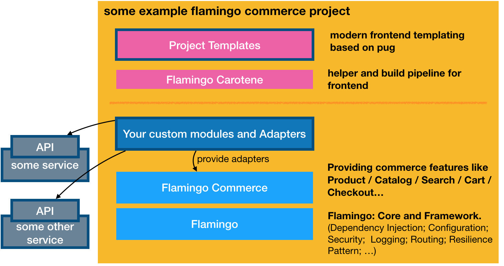
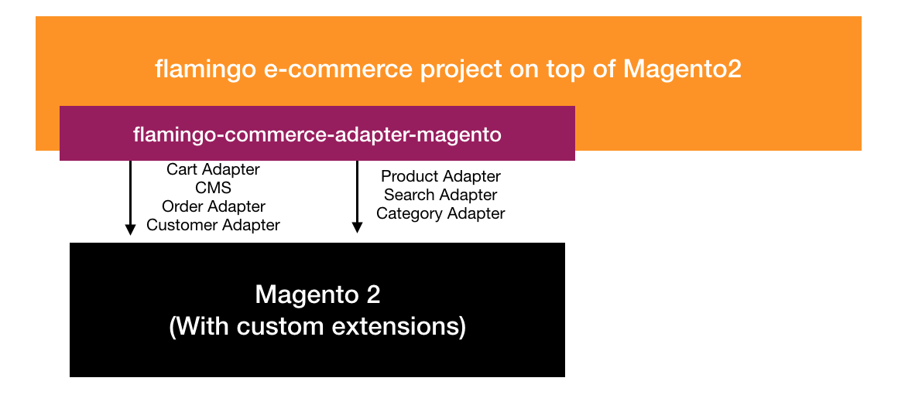
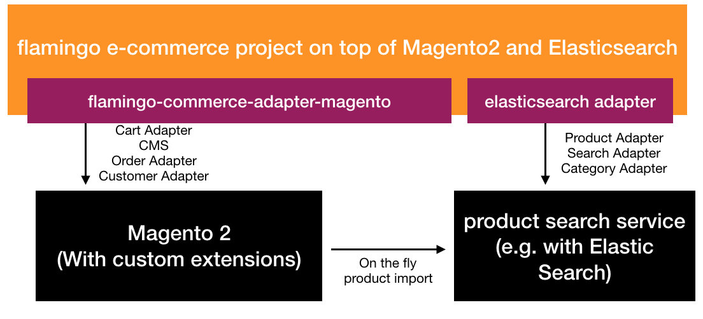
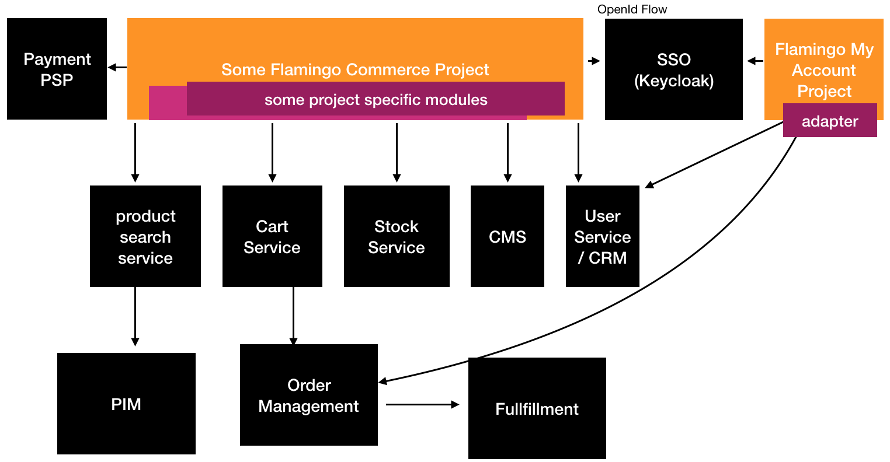
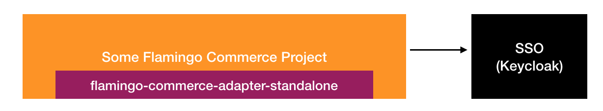

# About flamingo commerce

With "Flamingo Commerce" and "Flamingo Carotene" you get your toolkit for building **Blazing fast commerce experience layers**

* Contains flamingo modules that provide „domain“, „application“ and „interface“ logic around commerce features
* According to „ports and adapters“ these modules can be used with your own „Adapters“ to interact with any API or microservice you want.

**Flamingo Commerce is build on top of the Flamingo Framework so it makes sense that you read throughthe Flamingo docs first**

## A flamingo-commerce project

A typical flamingo commerce based e-commerce project would have:

* Its own templates (of course) . The templates should be build with the pugtemplate engine and can use the flamingo-carotene frontend build pipeline.
* Has the dependency to flamingo and flamingo-commerce packages (using dep)
* specific flamingo modules, that provide adapters (=implementation of secondary ports in flamingo-commerce modules) for the commerce modules. This can be adapters that call other microservices and external APIs for example.
* Instead of the specific implementations of adapters, you can also select between available adapters from the open source community:
    * *flamingo-commerce-adapter-standalone* Implementations that work complete without communications to any external service. It provides features to load product data from CSV and keeps cart and checkout in memory. It can be used as a quickstart
    * *flamingo-commerce-adapter-magento* Implementations to use flamingo with Magento 2.

So a possible e-commerce project build with flamingo commerce may look like:

## Possible Architectures

### Flamingo Commerce with Magento2

Flamingo can for example be used as „Head“ for a „Headless“ Magento 2 Setup.

* Products are loaded in memory for better performance on start up
* Cart and Checkout interacts with the Magento2 APIs
* Currently there is still the need to install additional Magento2 extension, in order to expose missing features in Magento2 standard Rest API, that we need for cart features.

### Flamingo Commerce with Magento2 and Elasticsearch

An improved setup will use a proper product-service (e.g. based on elasticsearch) to query and search product data:

* Products live in a product-service, that offers a blazing fast and feature rich API to access, search and filter for products. (E.g. based on Elasticsearch)
* Flamingo product and search features use this Elasticsearch service
* Cart and Checkout interacts still with the Magento2 APIs
* In this scenario magento also need an additional extension to load at least basic product data from the product service to use the cart features.

### Flamingo Commerce in a Microservice architecture

A typical commerce based microservice architecture could look like this:

In this example we see two different flamingo projects:

* one for the core commerce experience - including product search, cart and checkout. This project interacts with microservices like productsearch, cartservice, stockservice and a cms service for example.
* a second one that includes the my account features, that interacts with a order management system for example.

In this szenario also a single sign on solution such as [keycloak](https://www.aoe.com/techradar/tools/keycloak.html) is suggested. Flamingo of course comes with modules supporting the openId Connect flow and OAuth2.0 out of the box.

### Flamingo Commerce standalone

By using the *flamingo-commerce-adapter-standalone* module its also possible to run a flamingo based webshop like this.

* In this scenario also a SSO solution might be useful, in case you want to support login
* This scenario is not recommended for large scale shops, but might be a possible start.

## Demo

The deome flamingo commerce project shows some of the features, and is using  *flamingo-commerce-adapter-standalone*.