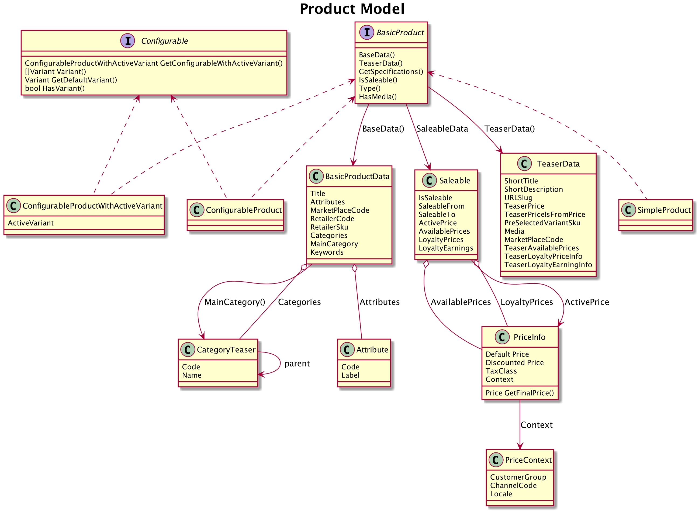

# Product Module

* Provides product domain models and the related secondary ports
* Provides controller for product detail view, including variant logic
* Provides template functions for:
    * get a (filtered) list of products (e.g. for product teasers)
    * get product urls
    * get a specific product

## Domain Layer
* A product is identified by a "MarketplaceCode"
* There are different product types, each of them need to implement the `BasicProduct` interface.

### The product model


## Details about Price fields


* The product has one main price (see PriceInfo Property) that stands for the value of that product.
* The product has a maintained price in a certain currency - eventually different by channel or locale.
* The price is either maintained as gross (B2C use cases) or net price (B2B use cases). How to interpret the price is up to the cart and view logic. 
    * Any logic depending on the gross/net knowledge should use the configuration under `commerce.product.priceIsGross`

* the product might be currently discounted and has a discounted price (the discounted price is also either gross or net like the normal price)

About Charges:
* A Charge is a price that needs to be paid for that product. This is normally the product price.
* But this concept allows to control "in what currency and type" a customer needs to pay the price of the product (See loyalty below)

Loyalty prices:
* The product might also have loyalty prices that allows to set a price in points, but also a minimum amount of points that need to be spent.
* In cases where the customer needs to spend a certain amount of points, the Method "GetCharges()" will return the different charges. Again it is up for other modules to interpret if this is gross or net.

### Secondary Ports
The module defines two secondary ports:

* ProductService interface to receive products
* SearchService interface, to search for product by any passed filter

### Product Types

#### Simple Products
Represents a simple product that can be purchased directly.

#### ConfigurableProduct and ConfigurableProductWithActiveVariant
Represents a product, that has several Variants. The configurable product cannot be sold directly.

But from a "Configurable Product" you can get the Saleable Variants - this is a product with Type "ConfigurableProductWithActiveVariant"

Here is an example illustrating this:

```go
   // ...
   // productService is the injected implementation of interface "ProductService"
   product, err := c.productService.Get(ctx, "id_of_a_configurable_product")
   if product.Type() == TYPECONFIGURABLE {
      // type assert ConfigurableProduct
      if configurableProduct, ok := product.(ConfigurableProduct); ok {
        variantProduct, err := configurableProduct.GetConfigurableWithActiveVariant("id_of_an_variant")
      }
   }
```

## Product Detail View

The view gets the following Data passed:

```go
    // productViewData is used for product rendering
    productViewData struct {
        // simple / configurable / configurable_with_variant
        RenderContext    string
        Product          domain.BasicProduct
        VariantSelected  bool
        VariantSelection variantSelection
        BackURL          string
    }
```

## Template functions

### getProduct

Returns the product or nil:
`- var product = getProduct("marketplacecode")`


### getProductUrl

Returns the correct url to the product:
`getProductUrl(product)`

The returned products urls slug will be

* generated if the confuration `commerce.product.generateSlug` is set to true
* use the configured attribute to fetch the utlSlug from the product data.

### findProducts

findProducts is a template function that returns a search result to show products:

* it will dynamically adjust the search request based on url parameters that match the given namespace
* the template function requires 4 parameters:

    * `namespace`: A name of the findProduct call - it is used to check URL parameters with that namespace
    * `searchConfig`: A map with the following keys supported:
    
        * `query`: Optional - the search string that a "human" might have entered to filter the search
        * `pageSize`, `page`: Optional - set the page and the pageSize (for pagination)
        * `sortBy`, `sortDirection` (`A`/`D`): Optional - set the field that should be used to sort the search result
        
    * `keyValueFilters`: Optional - A map of key values that are used as additional keyValue Filters in the searchRequest
    * `filterConstrains`: Optional - A map that supports the following keys:
    
        * `blackList` or `whiteList` (if both given `whiteList` is preferred): This is a comma separated list of filter keys, that are evaluated during:
        
            * using url Parameters to set keyValueFilters - only allowed keys will be used
            * modifying the searchResult `FacetCollection` and remove disallowed facets

See the following example:

```pug

  - 
    var searchResult1 = findProducts("list1",
                                    {"query":"","pageSize": "10","sortDirection":"A","sortBy":'name'},
                                    {"brand":"Hello Kitty"},
                                    {"whiteList":"brand,color,sortBy"})

  ul
    each product in searchResult1.products
      li Title: #{product.baseData.title} Retailer: #{product.baseData.retailerCode} Brand: #{product.baseData.attributes["brandCode"].value}
      
    - 
      var searchResult2 = findProducts("list2",
                                      {"query":"","pageSize": "10","sortDirection":"A","sortBy":'name'},
                                      {"brand":"Hello Kitty"},
                                      {"whiteList":"brand,color"})
  
    ul
      each product in searchResult2.products
        li Title: #{product.baseData.title} Retailer: #{product.baseData.retailerCode} Brand: #{product.baseData.attributes["brandCode"].value}
```

It will show in the list1 10 products that match the brand "Hello Kitty".
If you call the page that contains the call to that template function with urlparameters, the response can be dynamically modified.
For example:

`URL/?list1.brand=Apple&list2.color=black`

will modify the result of the two lists accordingly - while

`URL/?list2.notallowedkey=black`

will not.


## FakeService

With enabled fake services `domain.ProductService` and `domain.SearchService` are responding with preconfigured fake products on invocation.   

````yaml
commerce: 
	product: 
		fakeservice: 
			enabled: true # boolean: enables fakservices
			currency: *"€" | !="" # string: currency for the fakeservices
			jsonTestDataFolder: string | *"testdata/products"
````

The configuration option `jsonTestDataFolder` tells fakeservices to look for json files with product data in the defined folder. 
Json files represent MarketPlaceCodes with their filename and `domain.BasicProduct` within the contents.
You can find an example product under: `test/integrationtest/projecttest/tests/graphql/testdata/products/json_simple.json`

### SearchService
The fake service returns specific products if the query matches their marketplace code. This corresponds to the file name of the products in your project. There are also available default products with the marketplace codes:
- fake_configurable
- fake_configurable_with_active_variant
- fake_simple
- fake_simple_with_fixed_price
- fake_simple_out_of_stock
- fake_fixed_simple_without_discounts

If you query the fake service with `no-results` no products are returned.
In case no product with the given query is found and `no-results` is not used all preconfigured fake products are returned.

## Dependencies:
* search package: the product.SearchService uses the search Result and Filter objects.
